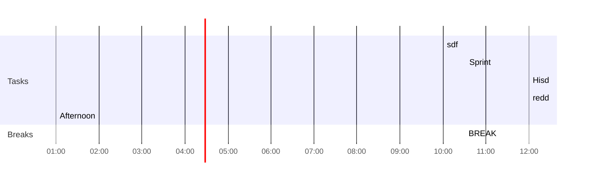

## Day Planner

Three Study Sprints Daily 

### Wakeup Routine - 08:30AM
- [ ] 08:30AM - Wakeup

### Morning - 10:00AM PST 
- [x] 10:00 sdf
- [x] 10:30 BREAK
- [x] 10:32 Sprint
- [x] 12:00 Hisd
- [ ] 12:00

### Lunch - 12:00PM
- [x] 12:00 redd

### Afternoon - 01:00PM - Heavy Task Work
- [x] 01:00 Afternoon

